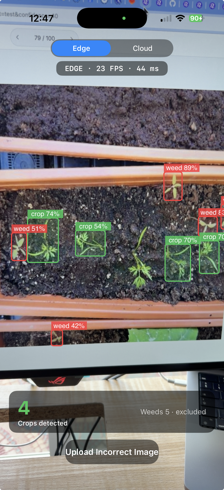
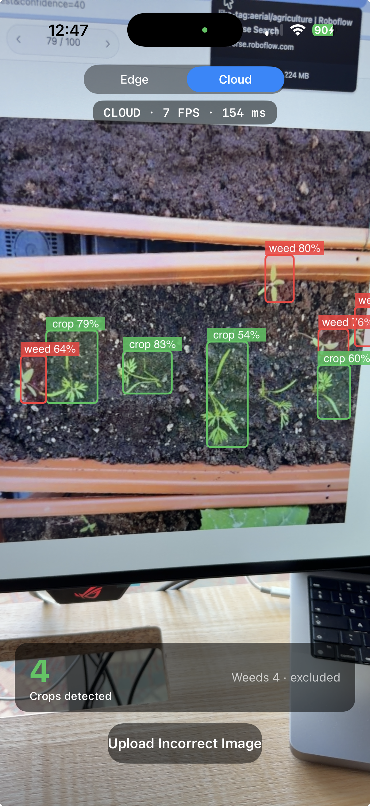

# Weed-Crop Detection on iPhone via Roboflow

> Real-time weed/crop detection on iPhone via Roboflow — and a view of what happens to the customer conversation once dataset collection, annotation, model training, and edge deployment all become platform features instead of bespoke engineering programs.

- **Dataset**: [`roboflow-100/weed-crop-aerial`](https://universe.roboflow.com/roboflow-100/weed-crop-aerial)
- **Model**: RF-DETR via Roboflow hosted training
- **Deployment**: iPhone via [`roboflow-swift`](https://github.com/roboflow/roboflow-swift)

---

## The customer story

I previously led delivery of an annotation platform for a **top-3 global crop-science company**'s plant-breeding program. Their tractor-mounted field imaging system captured **~600 km of maize-field imagery per season**, and they needed per-row plant counts to drive breeding decisions where a **3% yield improvement gates whether a hybrid advances to the next trial stage**.

They already had a working object-detection algorithm for sunflowers, but it didn't transfer to maize — overlapping plants after the 4-leaf stage, weed confusion, halogen lighting at night, varietal color variation, and edge artifacts all confounded it. They'd already evaluated and rejected Mechanical Turk; the labeling task was too complex and the turnaround too slow.

**What we built**: a 3-class human-in-the-loop annotation web app — *plants*, *weeds*, *other* — with **5-user consensus per image** and a difficulty-rating feedback loop. Java backend on OpenShift with async messaging, Angular frontend. The output was ground-truth training data to feed a custom detection algorithm.

**Total delivery**: ~12 months, multiple teams, ongoing maintenance burden. Three growth time points: 2-leaf (germination check), 4-leaf (plant stand established), 6-8 leaf (yield prediction). Target dataset: 3,000 images, 1,000 per time point.

---

## What this collapses to on Roboflow today

The same use case now lands in a few hours of work — because the two most expensive things in the original project (**collecting and labeling the dataset** and **training a custom algorithm from scratch**) are off-the-shelf:

1. **The dataset is open source.** Forked [`roboflow-100/weed-crop-aerial`](https://universe.roboflow.com/roboflow-100/weed-crop-aerial) — 1,176 pre-labeled aerial weed/crop images derived from peer-reviewed agritech research ([Sudars et al. 2020](https://www.sciencedirect.com/science/article/pii/S2352340920307277)), shipped as part of the Intel-sponsored [Roboflow 100 benchmark](https://github.com/roboflow-ai/roboflow-100-benchmark). **No annotation project needed.**
2. **The model architectures are pre-built and edge-ready.** Trained an **RF-DETR** variant via Roboflow hosted training — chosen over YOLOv5 for native CoreML compatibility and better on-device latency. The customer's original problem statement was *"build us a maize-counting algorithm from scratch."* The platform-era equivalent is *"pick a variant from the library."*
3. **Deployment is an SDK call.** iPhone 17 Pro via the [`roboflow-swift`](https://github.com/roboflow/roboflow-swift) SDK, built on top of [`roboflow-ios-starter`](https://github.com/roboflow/roboflow-ios-starter). (See reframing #4 below — the on-device artifact is trained with the open-source `rf-detr` package and converted on our own machine, since Roboflow's hosted CoreML export is a paid platform feature.)
4. **The labeling loop inverts.** Added a count-card overlay (crop stand count as the hero metric, with weeds detected but shown as the *excluded* confounder — mirroring the original engagement, where stand count was the decision and weeds were the thing to filter out) and an *"Incorrect Detection?"* button wired to `rf.uploadImage()` — so the field scout *using* the app becomes the labeler *in the flow of work*, replacing the original project's centralized 5-user consensus labeling.
5. **Edge vs. cloud is a live toggle.** The app runs the *same* detection task two ways — on-device CoreML and the Roboflow hosted API — switchable with an in-app segmented control. The latency/throughput trade-off (and what happens when connectivity drops) is something you watch on screen rather than argue about in the abstract (see reframing #3, and the Demo below).

> **On the dataset as a stand-in.** The public weed/crop set isn't the breeding data — it's a visible proxy for the proprietary maize-stand imagery I can't show. And the original engagement is precisely why I wouldn't *assume* it transfers: a working sunflower detector broke on maize (overlapping plants, weed confusion, varietal colour, night-time halogen lighting). So in a real engagement step one isn't "fork a public dataset and ship" — it's collect a small field sample and **measure out-of-distribution generalisation** before trusting it. Treating transfer as a discovery-phase question rather than an assumption is the lesson that whole project paid for.

## Production deployment target

The demo runs on iPhone because it's the most accessible edge target for a demo like this — and a phone walking a row is a fair stand-in for the rig-mounted camera. The production deployment that **closes the loop on the original engagement** is moving the plant-count inference *onto the rig itself*: an in-cab Jetson running RF-DETR as the tractor drives, instead of capturing ~600 km of raw imagery per season and batch-processing it weeks later.

"Real-time" here doesn't mean milliseconds — it means **within the field pass**. Three things make edge the right call, and only one is latency-to-action:

- **The phenology window is irreversible.** A 2-leaf stand count can't be re-captured once the field is at 6-leaf. With batch processing you find an occluded or low-confidence row weeks later, when it's biologically too late. On-rig inference flags it while the operator can still **re-drive the plot that day** — the action coupled to latency is *re-capture*, and its deadline is the growth stage, not a spray nozzle.
- **Data-volume economics.** 600 km/season × multiple field stations × three time points is a lot of gigabytes to move and store. Edge lets you keep *the count*, not the raw imagery.
- **Connectivity.** A field station mid-plot has no reliable uplink, so hosted-API-per-frame isn't viable there regardless.

The *millisecond* latency driver — the one people reach for first — notably **doesn't** apply: counting fires no instant actuator. Edge still wins on the other three. That discrimination is the whole point (see reframing #3): edge-vs-cloud is a per-use-case decision, not a reflex.

The same trained model also targets adjacent edge deployments via Roboflow's paths (CoreML for iOS, ONNX/TensorRT for Jetson, Inference Server for x86):

- **Jetson on a multirotor agricultural drone** — plot phenotyping at flight pace, on-board inference for in-flight coverage decisions
- **On-board module on a precision-spray robot** — the *real-time weed-control* case: per-row herbicide-nozzle decisions (the John Deere See & Spray family). A different objective the same stack enables — but **not** what the original breeding engagement was about.

Picking the target is itself a discovery conversation: *"show me the deployment that matches the customer's actual hardware budget and operational pattern."*

Worth flagging the hardware evolution underneath: agricultural aerial imagery was historically dominated by **fixed-wing UAVs** (longer flight time, larger area coverage); robust **multirotor agricultural drones** with multispectral payloads and the Jetson-class on-board compute they need are a much more recent capability. The platform shift isn't just "better software" — it's better software running on a new generation of edge hardware that genuinely didn't exist for this use case until the past few years.

**Total build wall-clock**: roughly _TODO: actual hours_ across 2 days.

| Metric | Value |
|---|---|
| Dataset size | 1,176 images, 2 classes (3 COCO categories) |
| Architecture | RF-DETR Small (single-scale, n_levels=1) |
| Training | ~27 min hosted (paid) **or** ~85 min free Colab T4 — equivalent accuracy |
| mAP@50 / @50:95 | hosted 0.7747 / ~0.47  ·  free Colab ~0.76 / 0.497 |
| On-device export | CoreML `.mlpackage` 55 MB (fp16) · ONNX 117 MB — both self-converted & validated |
| iPhone 17 Pro inference | **edge** on-device CoreML ~23 FPS / 44 ms · **cloud** hosted API ~7 FPS / 154 ms (same model, measured live via the in-app toggle) |

---

## Demo

The same RF-DETR model, the same frame, two deployment paths — switched live with the in-app toggle:

| Edge — on-device CoreML | Cloud — Roboflow hosted API |
|---|---|
|  |  |
| `EDGE · 23 FPS · 44 ms` | `CLOUD · 7 FPS · 154 ms` |

On-device inference is ~3× the throughput and runs with no connectivity; the hosted path needs a round-trip per frame. The count card reads the **crop stand count** (weeds detected but excluded from the count), and the *"Upload Incorrect Image"* button feeds field corrections back to the dataset. The edge and cloud boxes differ slightly because they run different checkpoints of the same architecture (Colab-trained on-device vs Roboflow-hosted) — the point isn't numeric parity, it's that one trained model deploys both ways.

_TODO: insert demo video link or embedded clip_

---

## What this changes about the customer conversation

The reframings that come out of actually building this:

1. **The biggest cost line in the original engagement was data, not modeling.** Collecting raw imagery, building the annotation tool, running the 5-user-consensus labeling project — that was the bulk of the 12 months. The model was downstream. Today the open-source dataset library + the in-app *"Incorrect Detection?"* feedback button collapse both ends of the data lifecycle. That's a different customer business case to discover against, not just a different tech stack.
2. **Edge isn't a deployment afterthought; it's an architecture decision upstream.** RF-DETR vs. YOLOv5 isn't an academic comparison — it determines whether the model can ship to iOS via the Swift SDK, to a Jetson via TensorRT, or only via the hosted API. Surfacing this trade-off in early discovery — not at deployment time — is what de-risks the deal. (Building this surfaced a concrete instance: YOLOv5 and old-format models don't load through the Swift SDK's runtime path — traced to a [documented SDK issue](https://github.com/roboflow/external-bugtracker/issues/4) affecting older CoreML formats — while current RF-DETR exports do. Deployment-path compatibility is a discovery question.)
3. **Edge vs. cloud is a *use-case* decision, not a default.** "Put it on the device" is right only when the inference is coupled to a real-time action and/or runs without connectivity. The original breeding rig is the clean example: per-plant counting was a *batch/cloud* workload — capture the season, process later — but moving it on-rig (to catch a bad row while the growth-stage window is still open, and to avoid hauling 600 km of raw imagery off every field) makes it an *edge* one, **even though nothing fires in milliseconds**. Same model; the target follows the decision latency and the connectivity, not a reflex for "on-device." The framework (latency-to-action, connectivity, volume economics) is in [`notes/architecture-choices.md`](notes/architecture-choices.md).
4. **"Free to prototype, paid to ship to the edge."** Roboflow gives away the expensive parts — GPU training and the hosted-API endpoint — but the **downloadable CoreML/weights artifact for offline on-device deployment is a paid (Core-plan) feature** (and the 14-day trial doesn't unlock it). That's a rational fence: the customers who need a *bundled* edge model are running at a scale where per-call hosted costs would dominate and a plan fee is trivial. So I pivoted to the **open-source `rf-detr` package (Apache-2.0)** to train and export the model myself at $0 — the legitimate self-host path. A wrinkle the docs revealed: rfdetr exports **ONNX/TFLite, not CoreML** (confirmed in the package source — `_onnx`/`_tensorrt`/`_tflite` exporters but no CoreML module; the CoreML path the docs list is the server-side conversion Roboflow offers as a platform feature), and `coremltools` dropped its ONNX path. **So I converted it myself** — a direct PyTorch→CoreML trace plus four targeted patches (the hard one: a rank-safe reimplementation of deformable attention, since its rank-6 sampling tensor exceeds CoreML's rank-5 cap) produced a validated `.mlpackage` (55 MB, fp16) that matches the open model bit-for-bit, at $0. That *sharpens* the build-vs-buy line rather than weakening it: the open stack **can** reach a working CoreML model — but it took senior ML-engineering (an attention rewrite + numerical validation + version-specific converter patches) and is brittle across model config, OS, and coremltools versions. The paid platform does that conversion turnkey and maintains it. So the real question isn't *"can you"* — it's *"do you want to own the conversion and its upkeep"* — and having actually done it, you can have that conversation honestly. (Full teardown in [`notes/training-setup.md`](notes/training-setup.md).)
5. **The platform replaces the *workflow that wraps the model*, not the model itself.** The model is commodity; the labeling tooling, hosted training, edge runtime, and data-feedback loop are what the customer is actually buying. Selling Roboflow well means leading with workflow, not weights.

---

## Run it yourself

```bash
# 1. Clone
git clone https://github.com/iacomus/roboflow-weedcrop-edge-demo.git
cd roboflow-weedcrop-edge-demo

# 2. Add your Roboflow credentials (never committed)
cp .env.example .env          # then edit .env with your API key, model, version
./scripts/gen-secrets.sh      # generates the gitignored Secrets.swift from .env

# 3. Install pods (the Podfile lives in the nested project dir)
cd "ios/Roboflow Starter Project" && pod install

# 4. Open the workspace (from that same dir)
open "Roboflow Starter Project.xcworkspace"

# 5. In Xcode: select your team under Signing & Capabilities,
#    plug in an iPhone (iOS 15.4+), Build & Run
```

Secrets are kept out of git: `.env` (your keys) and the generated `Secrets.swift` are both gitignored; `scripts/gen-secrets.sh` reads `.env` and writes `Secrets.swift`, which the app reads via `Secrets.apiKey` / `Secrets.model` / `Secrets.modelVersion`.

You'll need: Xcode, CocoaPods, a free Apple ID for signing, and a Roboflow account.

---

## Architecture decisions

See [`notes/architecture-choices.md`](notes/architecture-choices.md) for the rationale on:

- RF-DETR vs YOLOv5 vs YoloLite (iOS deployment compatibility)
- The empirical 5-model on-device deployment investigation (what loads via the Swift SDK and what doesn't, and why)
- The custom-model CoreML **export paywall** and the open-source local-training pivot
- The **edge-vs-cloud decision framework** (latency-to-action, connectivity, volume economics)
- Why use a forked RF100 dataset rather than the active workspace version
- Trade-offs between on-device inference and the serverless hosted API
- Why iPhone rather than Raspberry Pi or Jetson for this demo

The exact training setup, the hosted-model results (and the peak-then-overfit training dynamics), and the local RF-DETR training pipeline are in [`notes/training-setup.md`](notes/training-setup.md). The customer-story background is in [`notes/customer-story-background.md`](notes/customer-story-background.md).

---

---

James Al-Khatib · [LinkedIn](https://www.linkedin.com/in/jameskhatib) · [GitHub](https://github.com/iacomus)
